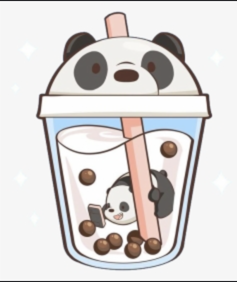

# PandaBoba
A site where you learn about boba and pandas.
Boba is the greatest thing ever invented 
And pandas are the kings of the world and should be kept in every household
My favorite boba place is cha 4 tea in long beach and irvine because they have honey green milk tea and their popcorn chicken is super delcious. 
Next would be class 302 cause quantity is over quality, but if you go go to the one in downey cause you can put as much boba as you want (after covid).
Also random comment, but doesn't boba look just like pandas and aren't pandas just the cutest creatures ever. 
If you really want high quality boba go to Taiwan cause thats were the good boba really is trust me :) 
Share tea is pretty good in Cerritos and Meet fresh, but their shaved ice is honestly better than their boba. 
Also if you like pandas you should go get a panda squishmellow from amazon. You should also invest in the pandas the sell at daiso and go to the zoo alot. 
Also but some bamboo in your room like me so that your panda stays with you at all times (I'm serious about this I actually have bamboo in my room :)

[PandaBobaImage](https://www.pngitem.com/so/tumblr-transparent/31/)
## Pandas
Pandas are so adorable they are like the cutest bears in existance and no one can deny this
I think that Pandas should be kept as a household pet and trust me my reasoning is very good and logical

**Reasons**
- Pandas are cute 
- Pandas like to play to
- Don't people have dogs 
- A panda is just a cuter version of a dog
- They will scare off robbers 

### Boba
Now I think that boba stores should be in replacement of every beverage stores cause Boba is just delicious
or people should just have a boba store in their house that would be even better. I think Boba needs to be introduced to everyone around the world cause it's that important and you literally cannot live without it. 

_reasons_ 
- Boba is super healthy 
- It's good for your digestive system (kinda don't fact check this) 
- It's also a food and a drink a 2 in 1 
- And it can help stop coffee addictions :))) 

**Now I know after reading this you won't be able to stop drinking boba and wanting a pet panda ;)**
